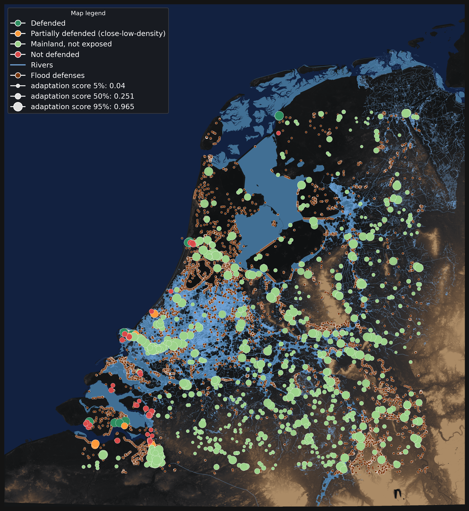
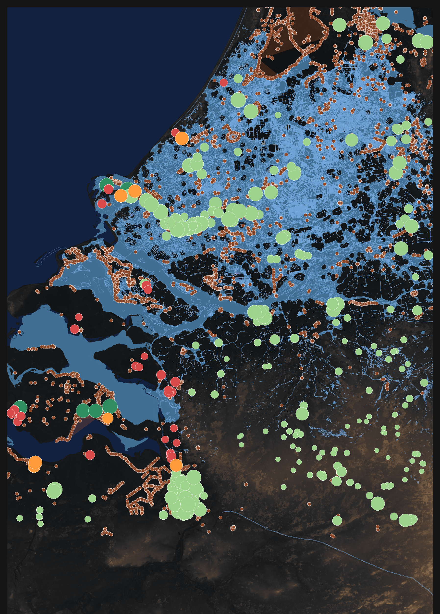

# GeoAssetAI — Asset-Level Adaptation Readiness

This repository contains a reproducible, geospatial AI pipeline for computing an
asset-level **adaptation / structural protection proxy** using elevation data,
hydrology, and flood defense infrastructure.

The project is designed to support climate and physical-risk analytics by
transforming heterogeneous geospatial inputs into **model-ready, auditable
asset-level metrics**.

  

  <em>Asset-level adaptation score across the Netherlands, combining flood-defense proximity, local defense density, and coastal exposure.</em>

  

  <em>Zoomed view of the Rotterdam–Antwerpen corridor highlighting defended, partially defended, and non-defended assets.</em>

---

## Why asset-level readiness scores matter

Climate and physical risks are asset-specific, yet most public indicators are aggregated at regional scales. Per-asset readiness scores enable risk differentiation within portfolios and help identify assets that are structurally protected versus those with unmanaged exposure — informing adaptation planning, insurance underwriting, and capital allocation.

---

## Scalability & extensibility

The pipeline is built on standard geospatial primitives (raster DEMs, vector hydrology, defense geometries) and efficient spatial algorithms (Euclidean Distance Transform, KD-Tree indexing). Inputs are normalized to a projected CRS and processed in raster and vector stages so the approach scales to hundreds of thousands of assets. Extending to new geographies requires substituting equivalent DEMs, land masks, and hydrology layers without altering core logic.

---

## Technical challenges, data risks & mitigations

**Challenges**
- Distinguishing sea vs inland water in very low terrain.
- Inconsistent geometry quality and coverage in open datasets (e.g., OSM/Geofabrik).
- Computing proximity and density metrics efficiently at asset scale.

**Mitigations**
- Deterministic rule combining DEM thresholds (e.g., `DEM <= 0`) with authoritative land masks to label sea areas.
- Geometry normalization, morphological cleaning and size filtering to stabilize water/lake polygons.
- Raster Euclidean Distance Transform (EDT) and KD-Tree queries to avoid expensive pairwise spatial joins, enabling fast rescoring.

**Residual risks**
- OSM/Geofabrik coverage variability, static DEM assumptions, and temporal mismatch between datasets. The pipeline is data-agnostic and accepts higher-quality proprietary layers when available.

---

## Data sources & assumptions

**Primary inputs**
- **DEM:** raster Digital Elevation Model (projected to EPSG:28992). Treated as static terrain.
- **Land mask:** Natural Earth (or equivalent) to separate land from open sea.
- **Hydrology:** OpenStreetMap/Geofabrik water polygons and waterways (rivers, channels, lakes).
- **Defenses:** Vector dataset of flood defenses (polygons/lines/points) normalized across types.
- **Assets:** Point dataset of asset locations to score.

**Key assumptions**
- Coastal exposure is approximated by `(DEM <= 0) AND not in land_mask` combined with selected OSM water polygons.
- Proximity to defenses and local defense density is used as a proxy for structural protection.
- Datasets are treated as static snapshots; temporal changes in infrastructure or water extent are not modeled here.

---

## Outputs

- `data/assets_scored_rescored_fast.geojson` — per-asset scores and categories  
- `figures/*` — final dark-theme national map and Rotterdam–Antwerpen zoom  

---

## Notebooks (run in order)

1. `01_data_prep.ipynb` — load and reproject DEM, Natural Earth land, Geofabrik water.  
2. `02_sea_land_masks.ipynb` — produce `sea_raster_bool.npy`, `final_sea_polygons.geojson`, `shore_points.npy`, and basemap preview.  
3. `03_defense_sampling.ipynb` — normalize/expand defense geometries and sample defense points.  
4. `04_scoring_and_mapping.ipynb` — compute distances, density, `main_score` (adaptation score), assign categories, and produce maps.  
5. `05_report_and_exports.ipynb` — exports, CSV summaries and final figures.

---

## How to run (local, minimal)

1. `pip install -r requirements.txt`  
2. Place inputs in `data/` (not tracked):  
   - `merged_dem_rd_crop.tif` (EPSG:28992)  
   - Natural Earth land mask (raster or vector)  
   - Geofabrik water polygons & waterways (`all_geofabrik_water_polygons_clipped.geojson`, `all_geofabrik_water_lines.geojson`)  
   - Flood defense geometries (`real_flood_defenses_expanded.geojson`)  
   - Asset point dataset (European Pollutant Release and Transfer Register (E-PRTR) / Industrial Emissions Directive (IED) registry)  
3. Run notebooks sequentially in `notebooks/`.

---

## Notes

Large data files are intentionally excluded from version control. All processing steps are deterministic and reproducible given the same inputs. The pipeline is designed to be auditable: canonical intermediate files (raster masks and sampled defense points) are saved for review and downstream model integration.

---

## Notes

Large data files are intentionally excluded from version control.
The notebooks are deterministic and reproducible given the same inputs.

Commit change
